# Entity Capture

一个 **Fabric / NeoForge** 的 **客户端**模组：把 Minecraft 里的**任意实体**（含模组生物）
在 **1:1 原生分辨率**下转成带颜色的体素捕获包 `.mcvox`。
（Forge 1.20.1 支持已停止维护，详见下方说明。）

它是像素画工具 [**MC Block Studio**](https://github.com/yunfang1718128/mc-block-studio) 的配套采集端。

## 配套项目（联动）

两个仓库通过 `.mcvox` 一份格式解耦，可独立开发：

```
[Entity Capture 模组]                         [MC Block Studio]
游戏内捕获实体  ──►  .mcvox  ──►  导入 → 放大 N 倍 → 空心/填充 → 颜色匹配方块 → 导出 .litematic
```

- 本模组只负责 **Minecraft 域**：模型 → 四边形采集 → 占用 + 表面色 → `.mcvox`。
- 放大、空心/填充、方块匹配、`.litematic` 导出全在 [MC Block Studio](https://github.com/yunfang1718128/mc-block-studio) 完成。
- Studio 已内置 **82 种原版生物**的 `.mcvox`，可直接使用；本模组用于补录模组生物、重新捕获或私有实例。

## 支持的加载器 / 版本

| 加载器      | Minecraft | Java | 额外前置       | 发布产物                               | 状态      |
| -------- | --------- | ---- | ---------- | ---------------------------------- | ------- |
| Fabric   | 1.21.1    | 21   | Fabric API | `entity-capture-<版本>-fabric.jar`   | ✅ 持续维护  |
| NeoForge | 1.21.1    | 21   | 无          | `entity-capture-<版本>-neoforge.jar` | ✅ 持续维护  |
| Forge    | 1.20.1    | 17   | 无          | `entity-capture-<版本>-forge.jar`    | ❌ 已停止维护 |

> **Forge 1.20.1 已停止维护**：自 **v0.5.0** 起，本模组只维护 **Fabric / NeoForge（Minecraft 1.21.1）**，不再为 Forge 1.20.1 提供更新。此前已发布的 Forge 版本仍可继续使用，但不会再收到修复或新功能。

三种产物写出的 `.mcvox` 格式完全一致，仅头部 `modLoader` 字段区分为 `fabric` / `neoforge` / `forge`；MC Block Studio 无需改动即可读取。

## 下载 / 安装

- 下载：[GitHub Releases](https://github.com/yunfang1718128/entity-capture/releases) 里对应加载器的 jar。
- Fabric：把 `entity-capture-<版本>-fabric.jar` 放进 `.minecraft/mods/`，并装好 **Fabric API**。
- NeoForge：把 `entity-capture-<版本>-neoforge.jar` 放进 `.minecraft/mods/`，需要 NeoForge **21.1.x**（Minecraft **1.21.1**）。
- Forge：把 `entity-capture-<版本>-forge.jar` 放进 `.minecraft/mods/`，需要 Forge **47.x**（Minecraft **1.20.1**）。（**已停止维护，仅旧版本可用**）

## 环境要求

- Fabric：Minecraft **1.21.1**、Loader **0.19.5**、Fabric API **0.116.17+1.21.1**、Java **21**
- NeoForge：Minecraft **1.21.1**、NeoForge **21.1.x**、Java **21**
- Forge：Minecraft **1.20.1**、Forge **47.x**、Java **17**（**已停止维护**）

## 使用

进游戏后：

| 入口                     | 说明                                                                                                    |
| ---------------------- | ----------------------------------------------------------------------------------------------------- |
| **`H`**（默认键）           | 打开**实体选择器 GUI**：可搜索（名称 / ID）、按分类筛选（全部 / 被动 / 水生 / 敌对）、右侧 3D 预览；开启**多选**后可勾选任意多个生物、`全选` / `全不选`，一次批量捕获 |
| `/capturemob <entity>` | 捕获指定实体类型，如 `/capturemob minecraft:zombie`（带 tab 补全）                                                   |
| `/capturemob`（无参）      | 捕获准星所瞄的实体（含变体 NBT）                                                                                    |
| **`G`**（默认键）           | 快速捕获准星实体（含变体 NBT）                                                                                     |

捕获在客户端渲染线程完成，**逐个 / 每 tick 一个**，不卡帧；完成后聊天栏给出汇总。

## 输出

写入游戏根目录 `entity-capture/`：

- `minecraft_zombie_<时间戳>.mcvox` —— 捕获包（导入 MC Block Studio 使用）
- 头部包含 `mcVersion`、`modLoader`、`unitsPerBlock`、`dimensions`、`solid` 等字段，供 Studio 识别与还原。

所有生物（含被放大渲染的，如尸壳、巨人）统一按原生贴图 **1:1** 捕获，轮廓不会多一层或出现缺口。

## 配置

首次启动后在游戏根目录生成 `config/entity-capture.toml`（改后需重启游戏生效）：

| 选项               | 默认      | 说明                                                                                              |
| ---------------- | ------- | ----------------------------------------------------------------------------------------------- |
| `variantCapture` | `true`  | 捕获准星实体时复制其 NBT，保留颜色 / 品种 / 花纹等**变体**。部分模组用特殊姿态（坐、睡、自定义动画）实现外观，捕获会将其重置为站姿，可能与这些模组不兼容；如捕获异常可关闭本项。 |
| `keepEquipment`  | `false` | 是否保留鞍、马铠、项圈、手持与护甲等装备 / 装饰。                                                                      |

> 注意：`/capturemob <entity>`、GUI 与批量捕获按实体**类型**进行，无法携带变体，只会得到该类型的默认变体。

## 测试案例与已知问题

已在 **暮色森林**、**灾变**、**冰火传说（社区版）**、**方块宝可梦（Cobblemon）**、**车万女仆（Touhou Little Maid）** 等模组上做了不完全测试，绝大多数生物可以正常捕获模型（包括炎魔等）。其中 **方块宝可梦** 与 **车万女仆** 已在 **v0.5.0** 完成兼容（见下方截图）。但仍存在以下问题：

1. 冰火传说中的龙在捕获时可能捕获到特殊的 0 体素生物。
2. 部分生物的特殊层不能捕获（如章鱼共生体头上的章鱼、娜迦除了头部以外的体节、冰雪女王身旁的冰）。
3. 一些生物捕获得到 0 体素「棍木」，因此无法捕获。（车万女仆已修复）
4. 对于透明层兼容性不佳。
5. 方块宝可梦在捕获时会变成另一种宝可梦。（已修复，但是捕获宝可梦时会参考当前姿态，所以每次捕获产物均存在不同）
6. 一些模组的盔甲捕获支持度不佳，如Fantasy Armor等。（已修复，但一些特定的渲染器仍可能不兼容）

### 暮色森林

| 暮初恶魂                           | 巫妖                         |
| ------------------------------ | -------------------------- |
| 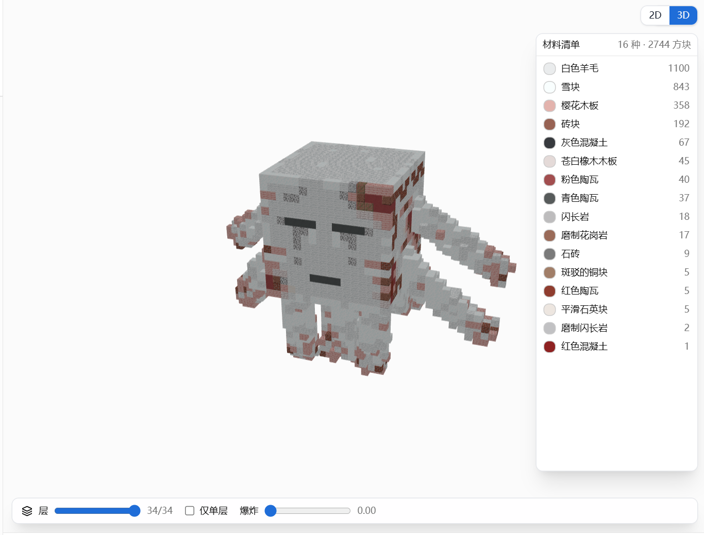 | 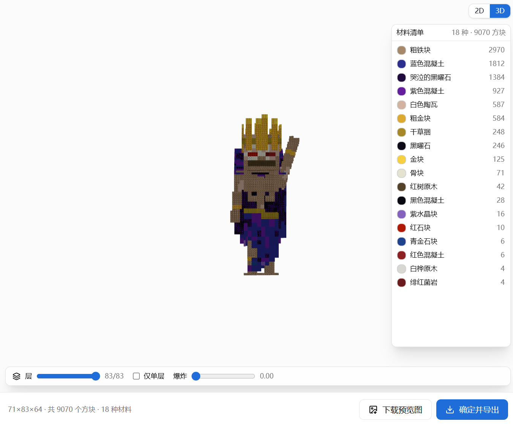 |

### 灾变

| 紫水晶巨蟹                        | 炎魔                     | 利维坦                      |
| ---------------------------- | ---------------------- | ------------------------ |
| 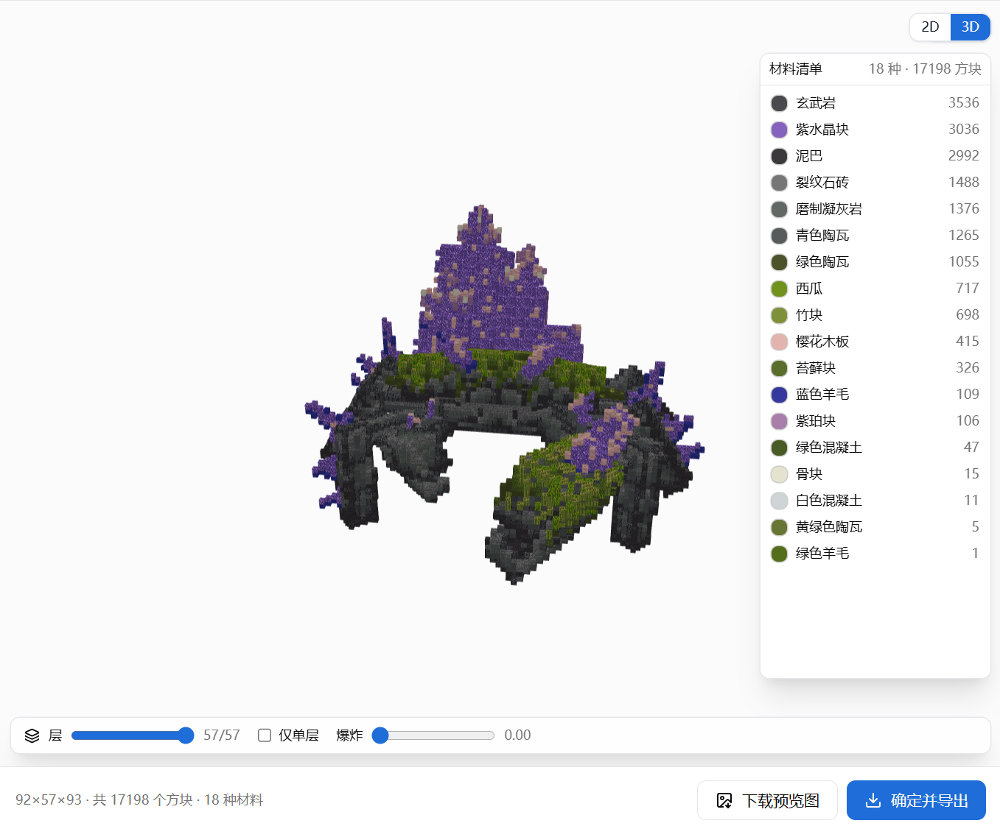 | 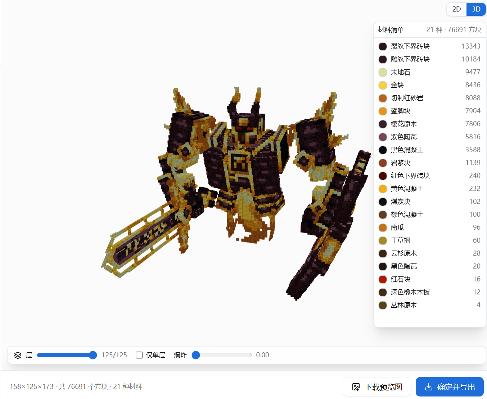 | 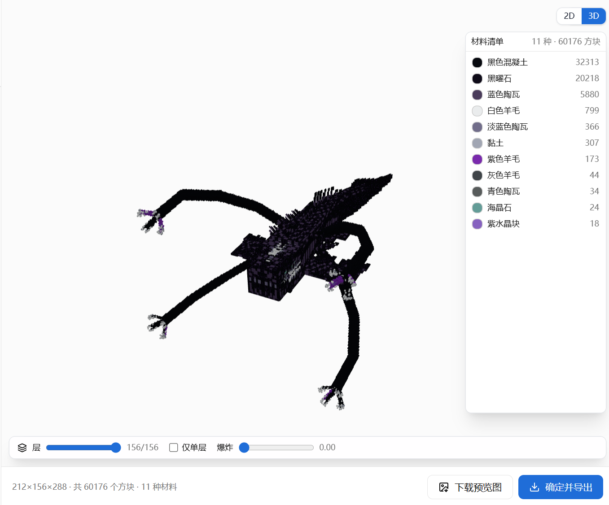 |

| 先驱者                      | 下界合金巨兽                         |
| ------------------------ | ------------------------------ |
| 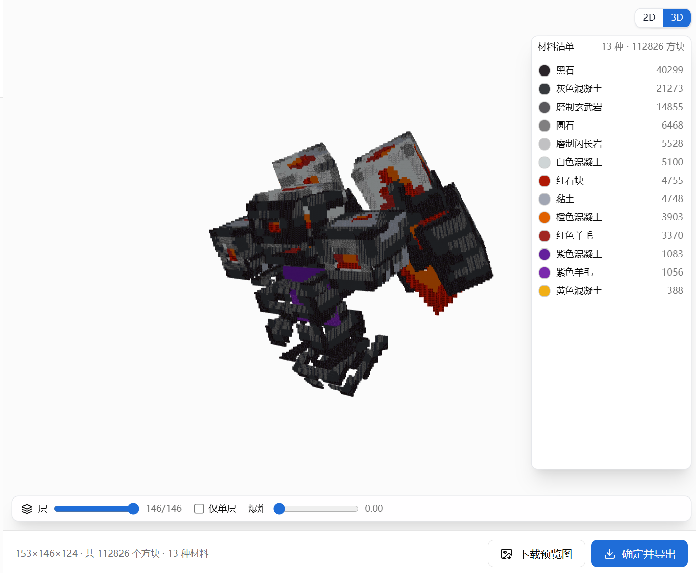 | 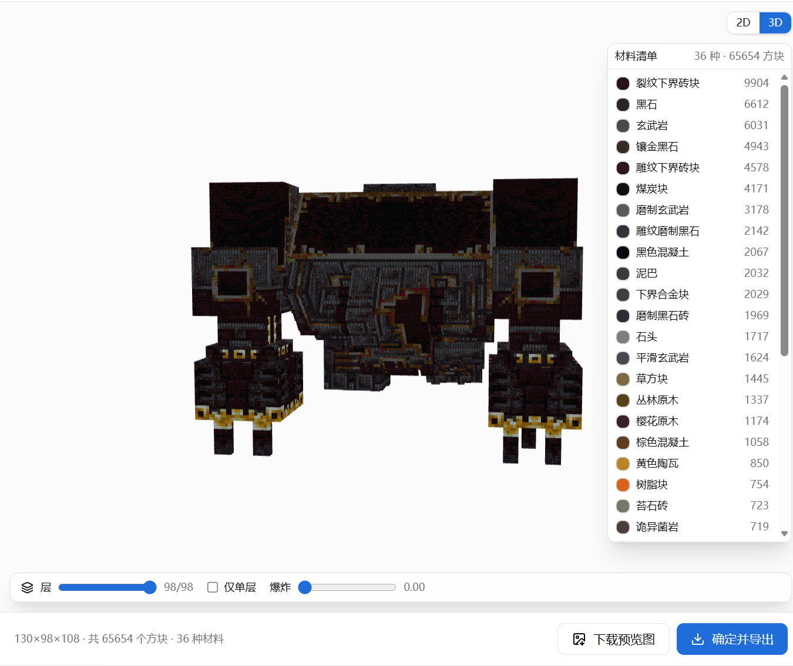 |

### 冰火传说（社区版）

| 龙                        | 鸡蛇                         | 独眼巨人                           |
| ------------------------ | -------------------------- | ------------------------------ |
| 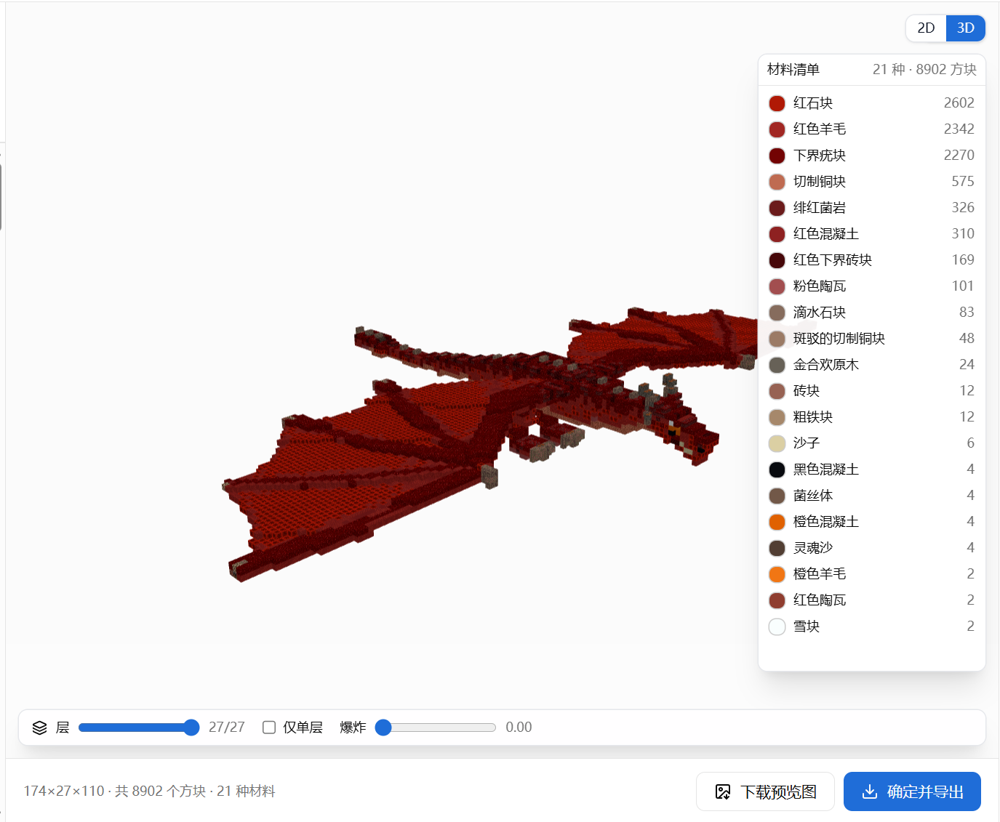 | 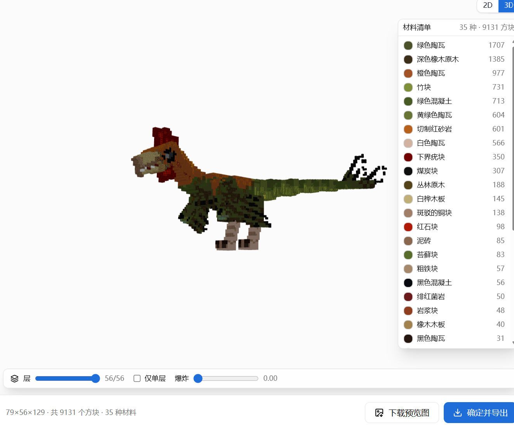 | 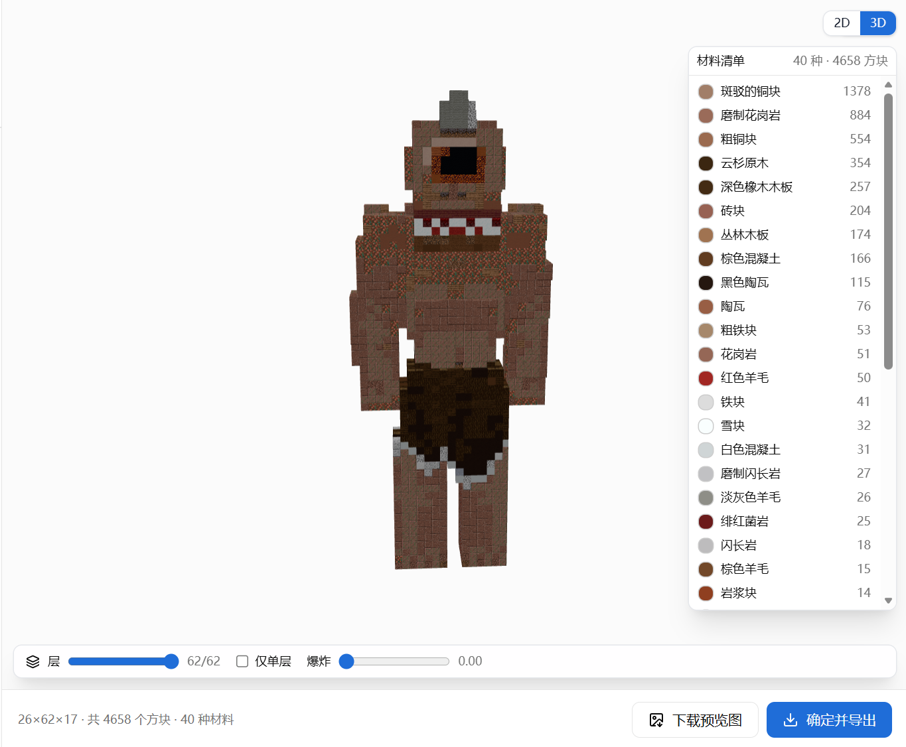 |

### 方块宝可梦（Cobblemon）

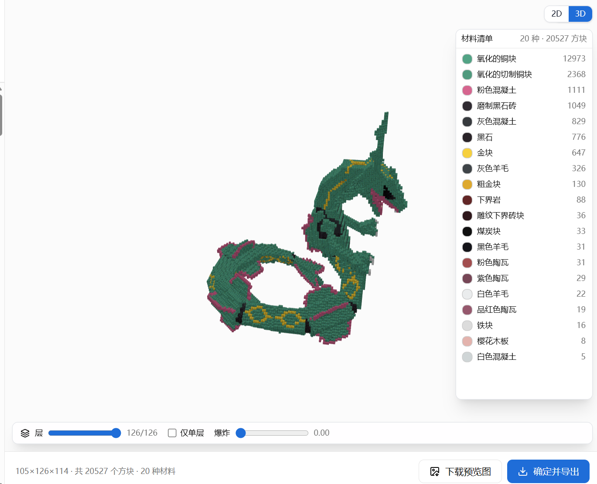

### 车万女仆（Touhou Little Maid）

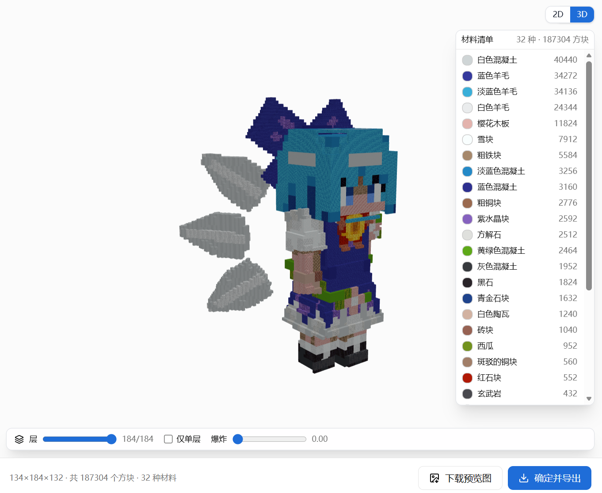

## 版权与免责声明

- 本模组是一个**本地工具**：它把游戏内实体的渲染结果转成体素数据（`.mcvox`），供你本人导入像素画工具使用。
- **“能够捕获某个实体的模型”并不代表你拥有该模型、贴图或角色形象的任何版权。** 实体模型、贴图、名称与角色形象等知识产权，归各自的模组作者及相关权利方所有；本模组不附带、也不授予任何此类权利。
- 请勿将包含第三方模组素材的捕获产物**公开分发、二次打包或用于商业用途**；由此产生的版权 / 许可纠纷由使用者自行承担。
- 本模组自身的源代码以 **MIT** 许可发布，见 [`LICENSE`](./LICENSE)。

## 许可证

MIT，见 [`LICENSE`](./LICENSE)。
